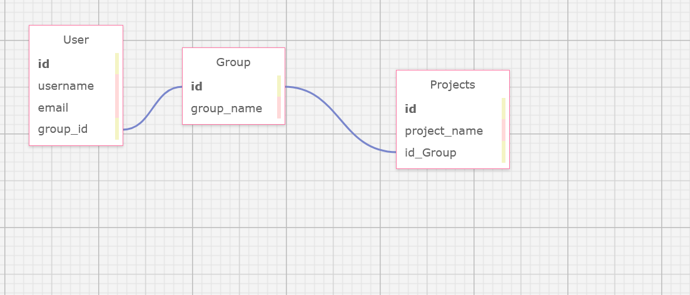

# Flask API Microserver Template

## Goal

Create a template for my picky favorite design patterns and libraries/frameworks for a microservice. Will be using example models and mock data for testing

## Prereqs

* Postgres
* Python (using version `Python 3.10.5`)
* Pyenv (reccomended)
* Virtualenv (reccomended)

1. Create a new python virtual environment for this project: `pyenv virtualenv flask-api-project`
2. Activate the environment: `pyenv activate flask-api-project`

### Iterations

#### Iteration 1



This is a basic visualization of our relational models we will be implementing as our first step. The goal will be for teach of these to offer CRUD functionality via REST API. Relevant tests should be included

First, we create our `.flaskenv` and give flask some information about our app.

```
FLASK_ENV=development
FLASK_APP=app/api
FLASK_RUN_PORT=8000
```

* We set our environment to development -- this will give debug information and stack traces for debugging purposes
* We set `FLASK_APP` to the `./app/api` module (this is where the flask app actually "lives")
* Set port for debug server (8000) `FLASK_RUN_PORT=8000`

Now, install `flask` and `python-dotenv`: `pip install flask python-dotenv` (Or if you've already downloaded the project's dependecies, you can skip this step (`pip install -r requirements`))

Next, we create the api module under the app directory: `touch app/api/__init__.py`. This tells python that the `api` directory is a python *module*

We are using an [app factory](https://flask.palletsprojects.com/en/2.3.x/patterns/appfactories/) building pattern, so we want to define our `api` module with the following:

```python
from flask import Flask


def create_app(test_config=None) -> Flask:
    """App factory pattern with context manager"""
    app = Flask(__name__, instance_relative_config=True)

    return app
```

Let's see if we can start a server, run the following in your terminal: `flask run`

You should see the following output:

```shell
flask run
 * Serving Flask app 'app/api'
 * Debug mode: off
WARNING: This is a development server. Do not use it in a production deployment. Use a production WSGI server instead.
 * Running on http://127.0.0.1:8000
Press CTRL+C to quit
```

If we send a GET request to the dev server from our browser (naviage to the URL) runnong on: `http://127.0.0.1:8000`, you should see the following output in your terminal:

```shell
127.0.0.1 - - [27/Jul/2023 17:46:52] "GET / HTTP/1.1" 404 -
```

*Note:* We are getting a 404 as we have not implemented any routes to handle requests to the index (`/`)

---

Now that we have a very early app actually running, let's implement our testing framework.

Install pytest: `pip install pytest`

Create an testing configuration file where we will define fixtures: `touch app/conftest.py`

We will now create a fixture for our app factory. We will import our `create_app()` function and use it to create an app instance; we `yield` the instance to introduce the object into the individual test's scope

```python
import pytest

from api import create_app


@pytest.fixture
# TODO: Add typing hint (flask.Flask ?)
def app():
    app = create_app(test_config="api.config.TestingConfig")
    yield app
```

Before we continue, let's ignore the test_config paramater value for a moment.

Let's implement a very simple test for the above fixture: we simply want to know if the `app` fixture returns an object (we do not specify type at all, we simply want to assertain that `app` exists and is not `None`): `mkdir app/tests && touch app/tests/test_fixtures.py`

```python
import pytest


def test_create_app_fixture(app):
    assert app
```

Run `pytest` in your terminal. You should see a single passing test!

```shell
$ pytest
================================================= test session starts ==================================================platform linux -- Python 3.10.5, pytest-7.4.0, pluggy-1.2.0
rootdir: /home/sam/projects/flask_api_template
plugins: anyio-3.6.2
collected 1 item

app/api/tests/test_fixtures.py .                                                                                 [100%]

================================================== 1 passed in 0.07s ===================================================
```

Now that we have the basics of our testing environment set up, let's create that test_config we set above in the app fixture. This will become much more important later when we need multiple environments (`prod`, `dev`, `test`, `stage`): `touch app/api/config.py`

Create the configuration file: `touch app/api/config.py` (This is a flask configuration file. Read more [here](https://flask.palletsprojects.com/en/2.3.x/config/) for more options and configurations)

First, we will create the base `Config` class our various environment-specific configurations will inherit from:

```python
import os


class Config(object):
    DEBUG = os.getenv("DEBUG", default=True)
    TESTING = (
        False  # False by default. When using the below TestingConfig we switch this one
    )
    CSRF_ENABLED = True  # Enable CSRF protection. We will discuss this more later
    SECRET_KEY = "change-in-prod"  # Our default SECRET_KEY we will use for debug, dev. test environments
```

Next, we simply want to switch our `TESTING` variable to `True` (put this underneath our `Config` class):

```python
class TestingConfig(Config):
    TESTING = True
```

Let's add another fixture, for the test_client of our app:

```python
@pytest.fixture
def client(app):
    """Fixture for accessing client instance in tests"""
    return app.test_client()
```

And a corresponding test:

```python
def test_app_client_fixture(client):
    assert client is not None
    assert client.application.name == "api"
```

Let's add one more test to make sure our client fixture can send requests. Make a new file: `touch app/api/tests/text_client_requests.py`

```python
import pytest


def test_request_example(client):
    response = client.get("/")
    assert response.status_code == 404  # We will remediate this later as we add routing.
```

Run `pytest` to ensure everything passes.

---

Now that we have some tests running and passing, let's implement our models. We'll start with the User model.

First let's implement our database (we will use [SQLAlchemy](https://www.sqlalchemy.org/) for our ORM (the thing that maps a database object to a Python class, our model)). Install sqlalchemy and it's flask extension: `pip install sqlalchemy flask-sqlalchemy`

Navigate back to the `app/api/__init__.py` module. Now that we've added multiple environmental specific testing, let's add some checks for which configuration to use. We will also set our global config variables after that logic:

```python
def create_app(test_config=None) -> Flask:
    ...
    # Check for correct config
    if test_config is None:
        if app.config["ENV"] == "production":
            app.config.from_object("api.config.ProductionConfig")
        else:
            app.config.from_object("api.config.ProductionConfig")
    else:
        app.config.from_object(test_config)

    app.config["API_TITLE"] = "Flask API"
    app.config["API_VERSION"] = "0.1.0"
    
    return app
```

Let's update our test to check for `API_TITLE` and `API_VERSION`:

```python
def test_create_app_fixture(app):
    assert app is not None
    assert app.name == "api"
    # These config vars are set in app/api/__init__.py
    assert app.config["API_TITLE"] == "Flask API"
    assert app.config["API_VERSION"] == "0.1.0"
```

Run `pytest` and everything should pass.

---

Now that we have some tests running and passing, let's implement our models. We'll start with the User model.

First let's implement our database (we will use [SQLAlchemy](https://www.sqlalchemy.org/) for our ORM (the thing that maps a database object to a Python class, our model)). Install sqlalchemy and it's flask extension: `pip install sqlalchemy flask-sqlalchemy`


Create a `models` module: `touch app/api/models.py`

Start by creating a test for a User model, with the attributes we want according to the tables we modeled above (ignore the relationships for now):
